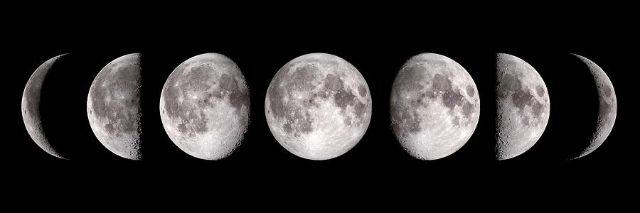

# Animal Bites and Lunacy

A comparison of animal bite data in Louisville, KY from 2010-2017 with phases of the moon.

---
## Project Overview:
---
- Imports data from CSV files to a SQL database
- Queries SQL database for relevant data
- Cleans data and merges into a Pandas dataframe
- Includes Tableau dashboard for visualizations
---
### Code and Resources Used:
- Python 3.10
- Pandas
- Jupyter Notebook
### Installing Dependencies:
- From the command line, input `pip install -r requirements.txt` from within the project directory to add required modules.
---
## Summary
---
The goal of this project is to discover if there is any correlation between animal bites reported in Louisville, KY between October 29th 2009 and September 8th 2017, and the phase of the moon when the bite occurred. The bite dataset contains reports from many other years, but the reporting is inconsistent and missing most of the applicable data points. 

## Sources
---
- [Animal Bites](https://www.kaggle.com/datasets/rtatman/animal-bites)
- [Daily Moon Illumination 1800 to 2100](https://www.kaggle.com/datasets/petermenzies/daily-moon-illumination-1800-to-2100)
---
## License
[GNU GENERAL PUBLIC LICENSE](LICENSE)